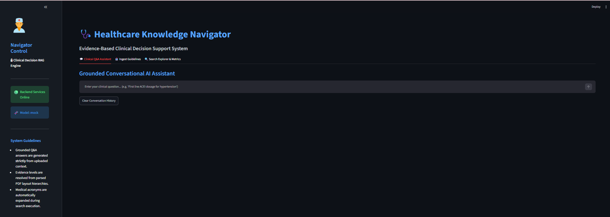
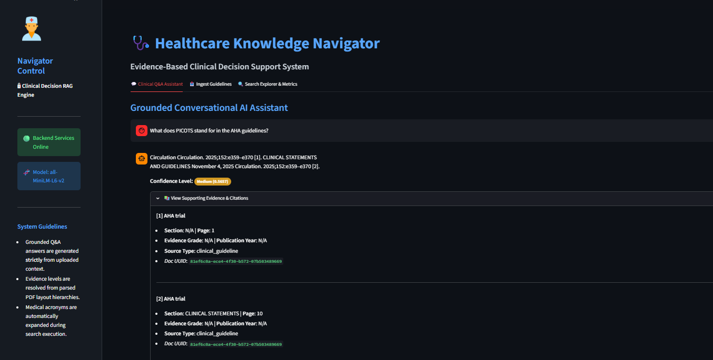
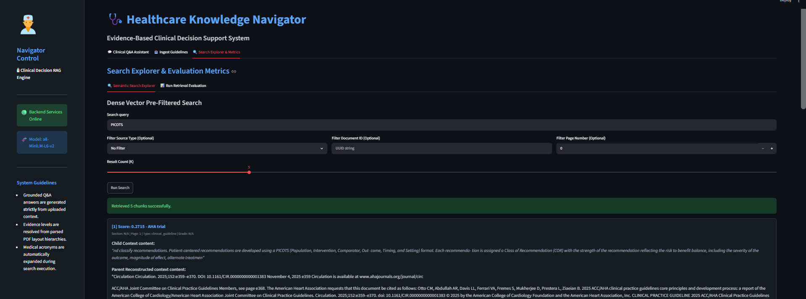
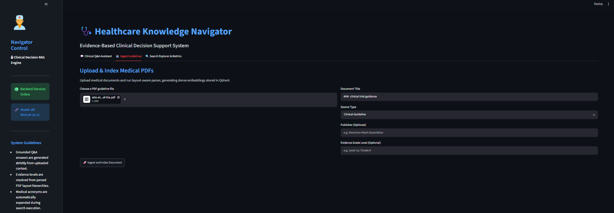
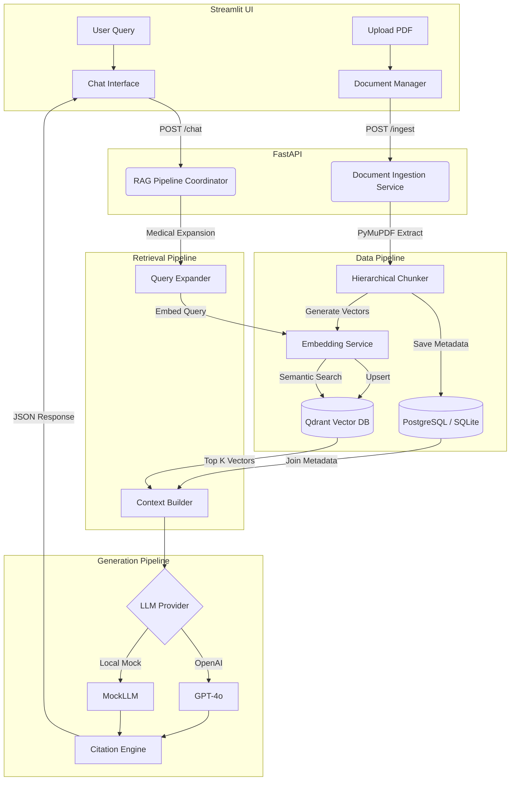

# Healthcare Knowledge Navigator


Healthcare Knowledge Navigator is an enterprise-grade Retrieval-Augmented Generation (RAG) system designed specifically for clinical environments. It allows healthcare professionals to securely ingest, process, and query massive clinical guidelines, trial data, and medical literature using advanced semantic search and AI generation.

## Screenshots

### Main Dashboard


### Clinical Question Answering


### Evidence & Citations


### Document Ingestion


## 🌟 Features

* **Advanced Document Ingestion:** Intelligent hierarchical chunking powered by `PyMuPDF` with metadata preservation (titles, headers, page numbers).
* **High-Performance Semantic Search:** Built on top of **Qdrant** for lightning-fast vector similarity retrieval using HuggingFace models (`all-MiniLM-L6-v2`).
* **Medical Query Expansion:** Built-in semantic expander that recognizes clinical acronyms and terminology (e.g., expanding "MI" to "Myocardial Infarction").
* **Deterministic Citations Engine:** AI-generated answers are strictly grounded in retrieved text, accompanied by bracketed citation markers mapped exactly to source documents and page numbers.
* **Confidence Scoring Pipeline:** Real-time generation of confidence metrics based on vector similarity thresholds to prevent medical hallucinations.
* **MockLLM Development Mode:** Fully functional local fallback that extracts smart summaries from chunks without requiring paid OpenAI API keys.
* **Interactive Chat Interface:** A sleek, conversational frontend built with **Streamlit**.

## 🏗 Architecture



## 🛠 Technology Stack

* **Backend:** Python 3.10+, FastAPI, Uvicorn
* **Frontend:** Streamlit
* **Vector Database:** Qdrant (Local or Cloud)
* **Relational Database:** PostgreSQL (Asyncpg) / SQLite (Dev)
* **Embeddings:** SentenceTransformers (`all-MiniLM-L6-v2`)
* **LLM Engine:** OpenAI (GPT-4o-mini) + MockLLMProvider
* **Document Processing:** PyMuPDF, Langchain Text Splitters

## 🚀 Setup Instructions

### 1. Prerequisites
- Python 3.10 or higher
- Git

### 2. Clone and Install
```bash
git clone https://github.com/yourusername/healthcare-knowledge-navigator.git
cd healthcare-knowledge-navigator

# Create and activate virtual environment
python -m venv .venv
# On Windows
.\.venv\Scripts\activate
# On Linux/Mac
source .venv/bin/activate

# Install dependencies
pip install -r requirements.txt
```

### 3. Configuration
Copy the sample environment file:
```bash
cp .env.example .env
```
Update `.env` with your API keys. If you do not have an OpenAI API key, leave `LLM_PROVIDER=auto` and set the key to `mock-api-key-for-development` to use the local `MockLLMProvider`.

### 4. Running the Application
You will need two terminal windows to run both the backend and frontend.

**Terminal 1: FastAPI Backend**
```bash
# Activate your virtual environment first
python -m uvicorn backend.app.main:app --reload --port 8000
```

**Terminal 2: Streamlit Frontend**
```bash
# Activate your virtual environment first
streamlit run frontend/app.py
```

The frontend will be available at `http://localhost:8501` and the backend API documentation at `http://localhost:8000/docs`.

## 📚 API Endpoints

### Documents
- `POST /api/v1/ingestion/upload`: Upload and index a PDF clinical document.
- `GET /api/v1/ingestion/documents`: Lists metadata for all ingested clinical files.

### Retrieval & Generation
- `POST /api/v1/rag/ask`: Submit a single query and receive a grounded answer, citations, and confidence score.
- `POST /api/v1/rag/chat`: Submit a query with conversation history for multi-turn contextual chats.
- `POST /api/v1/search/query`: Executes a semantic vector search query on Qdrant, resolves parent contexts, and returns metadata-grounded search results.
- `POST /api/v1/search/evaluate`: Evaluates semantic retrieval performance against a clinical test dataset, returning aggregate Mean Reciprocal Rank (MRR) and Hit Rate statistics.

### System
- `GET /health`: Standard heartbeat endpoint for container orchestrators.

## 📂 Project Structure

```text
healthcare-knowledge-navigator/
├── backend/
│   ├── app/
│   │   ├── api/          # FastAPI routes
│   │   ├── core/         # Configuration & DB Setup
│   │   ├── db/           # SQLAlchemy Models
│   │   ├── schemas/      # Pydantic validation schemas
│   │   └── services/     # Core Business Logic (LLM, Search, Embeddings)
│   └── main.py           # Application Entrypoint
├── frontend/
│   └── app.py            # Streamlit Interface
├── .env.example          # Environment variables template
├── requirements.txt      # Python dependencies
└── README.md
```

## 🗺 Future Roadmap
- [ ] Implement OCR capabilities for scanned clinical PDFs.
- [ ] Add explicit support for FHIR / HL7 data ingestion.
- [ ] Migrate default vector storage to Qdrant Cloud for production scaling.
- [ ] Add User Authentication and Role-Based Access Control (RBAC).
- [ ] Support open-source local LLMs (e.g., Llama 3) via Ollama integration.

## 📄 License
This project is licensed under the MIT License - see the LICENSE file for details.
